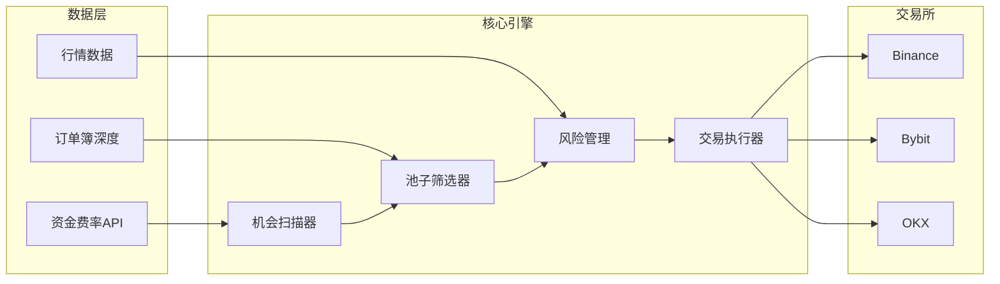
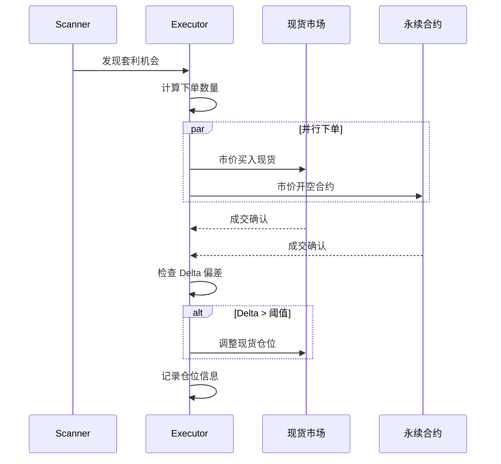

# 资金费率套利系统架构文档

> **版本**: v2.0  
> **最后更新**: 2026-01-04  
> **目标**: 针对小资金（100-10000 USDT）的永续合约资金费率套利系统

---

## 1. 系统概述

### 1.1 策略原理

永续合约通过**资金费率机制**使合约价格锚定现货价格：
- **正费率**: 多头支付空头（合约价格 > 现货价格）
- **负费率**: 空头支付多头（合约价格 < 现货价格）

**套利逻辑**：建立 Delta 中性头寸，赚取资金费率收益
```
正费率套利: 现货做多 + 永续做空 → 收取资金费
负费率套利: 现货做空(借币) + 永续做多 → 收取资金费
```

### 1.2 核心优势定位

| 优势 | 说明 |
|------|------|
| **流动性筛选** | 专注中低流动性池（日交易量 $500K-$5M），大资金无法有效操作 |
| **自动化执行** | 散户缺乏技术能力，我们用程序实现毫秒级响应 |
| **小资金灵活** | 100-10000 USDT 可快速进出，滑点影响可控 |

### 1.3 风险收益目标

- **预期年化**: 15%-50%（取决于费率环境）
- **最大回撤**: < 5%（Delta 中性策略）
- **单次费率收益**: 0.01%-0.3%（每 8 小时结算一次）

---

## 2. 系统架构

### 2.1 模块划分

```
funding_rate_arbitrage/
├── config/                 # 配置管理
│   ├── settings.yaml       # 全局配置
│   ├── exchanges.yaml      # 交易所配置
│   └── strategy.yaml       # 策略参数
├── src/
│   ├── core/               # 核心模块
│   │   ├── engine.py       # 套利引擎主循环
│   │   ├── position.py     # 仓位管理
│   │   └── risk.py         # 风险控制
│   ├── data/               # 数据层
│   │   ├── funding_rate.py # 资金费率采集
│   │   ├── orderbook.py    # 订单簿深度
│   │   └── market.py       # 行情数据
│   ├── exchange/           # 交易所适配器
│   │   ├── base.py         # 抽象基类
│   │   ├── binance.py      # Binance 适配
│   │   ├── bybit.py        # Bybit 适配
│   │   └── okx.py          # OKX 适配
│   ├── strategy/           # 策略逻辑
│   │   ├── scanner.py      # 机会扫描
│   │   ├── selector.py     # 池子筛选
│   │   └── executor.py     # 交易执行
│   └── utils/              # 工具函数
│       ├── logger.py       # 日志系统
│       ├── notifier.py     # 消息通知
│       └── helpers.py      # 辅助函数
├── scripts/                # 运行脚本
│   ├── run_scanner.py      # 启动扫描器
│   ├── run_arbitrage.py    # 启动套利
│   └── backtest.py         # 回测脚本
├── tests/                  # 测试用例
├── logs/                   # 日志文件
├── data/                   # 本地数据存储
└── docs/                   # 文档
```

### 2.2 数据流架构



---

## 3. 核心模块设计

### 3.1 池子筛选器 (Selector)

**筛选条件**（针对小资金优化）：

| 维度 | 最小值 | 最大值 | 说明 |
|------|--------|--------|------|
| 24h 交易量 | $500,000 | $5,000,000 | 避开大资金和死池 |
| 订单簿深度 | $10,000 | $100,000 | ±0.5% 价格范围内 |
| 资金费率绝对值 | 0.03% | - | 覆盖手续费后有利润 |
| 费率预测方向 | 稳定 | - | 避免费率反转 |
| 价差 (Spread) | - | 0.1% | 现货-合约价差不能太大 |

**筛选算法**：
```python
def filter_pools(pools: list[Pool]) -> list[Pool]:
    """
    筛选符合条件的交易池
    优先级: 费率收益 > 流动性安全 > 价差成本
    """
    candidates = []
    for pool in pools:
        # 流动性窗口检查
        if not (MIN_VOLUME <= pool.volume_24h <= MAX_VOLUME):
            continue
        # 深度检查
        if pool.depth_05pct < MIN_DEPTH:
            continue
        # 费率门槛
        if abs(pool.funding_rate) < MIN_RATE:
            continue
        # 价差检查
        if pool.spread > MAX_SPREAD:
            continue
        
        # 计算预期收益
        pool.expected_profit = calc_expected_profit(pool)
        candidates.append(pool)
    
    # 按预期收益排序
    return sorted(candidates, key=lambda x: x.expected_profit, reverse=True)
```

### 3.2 仓位管理 (Position)

**仓位规则**：

| 规则 | 值 | 说明 |
|------|-----|------|
| 单币种最大仓位 | 总资金 30% | 分散风险 |
| 总仓位上限 | 总资金 80% | 保留应急资金 |
| 杠杆倍数 | 1-3x | 低杠杆降低清算风险 |
| Delta 偏差容忍 | ±2% | 超出需调仓 |

**仓位数据结构**：
```python
@dataclass
class Position:
    symbol: str                 # 交易对
    spot_qty: Decimal          # 现货数量
    spot_avg_price: Decimal    # 现货成本
    perp_qty: Decimal          # 合约数量（负数为空头）
    perp_avg_price: Decimal    # 合约成本
    leverage: int              # 杠杆倍数
    margin: Decimal            # 保证金
    unrealized_pnl: Decimal    # 未实现盈亏
    funding_earned: Decimal    # 累计资金费收益
    opened_at: datetime        # 开仓时间
```

### 3.3 风险控制 (Risk)

**风险指标**：

| 指标 | 阈值 | 动作 |
|------|------|------|
| 保证金率 | < 50% | 警告 + 减仓 |
| 保证金率 | < 30% | 强制平仓 |
| 单笔亏损 | > 2% 本金 | 触发止损 |
| 费率反转 | 连续 2 期 | 平仓观望 |
| Delta 偏差 | > 5% | 强制调仓 |

**风险检查流程**：
```python
async def check_risk(position: Position) -> RiskAction:
    """
    每分钟执行一次风险检查
    返回: HOLD / REDUCE / CLOSE / REBALANCE
    """
    # 1. 保证金率检查
    margin_ratio = position.margin / position.notional_value
    if margin_ratio < 0.3:
        return RiskAction.CLOSE
    if margin_ratio < 0.5:
        return RiskAction.REDUCE
    
    # 2. Delta 中性检查
    delta = calc_delta(position)
    if abs(delta) > 0.05:
        return RiskAction.REBALANCE
    
    # 3. 费率方向检查
    if is_rate_reversed(position.symbol):
        return RiskAction.CLOSE
    
    return RiskAction.HOLD
```

### 3.4 交易执行器 (Executor)

**执行流程**：



**滑点控制**：
```python
def calc_order_size(pool: Pool, target_usd: Decimal) -> Decimal:
    """
    基于订单簿深度计算最优下单量，控制滑点 < 0.1%
    """
    depth = pool.orderbook_depth
    max_size_without_slippage = depth.get('0.1%', 0) * 0.5  # 取一半深度
    
    return min(target_usd, max_size_without_slippage)
```

---

## 4. 交易所集成

### 4.1 支持的交易所

| 交易所 | 优先级 | 费率结算 | API 特点 |
|--------|--------|----------|----------|
| **Binance** | P0 | 每 8h | 流动性最好，API 稳定 |
| **Bybit** | P1 | 每 8h | 费率波动大，机会多 |
| **OKX** | P2 | 每 8h | 深度好，费率合理 |

### 4.2 API 抽象层

```python
class ExchangeBase(ABC):
    """交易所抽象基类"""
    
    @abstractmethod
    async def get_funding_rate(self, symbol: str) -> FundingRate:
        """获取当前资金费率"""
        pass
    
    @abstractmethod
    async def get_predicted_rate(self, symbol: str) -> Decimal:
        """获取预测资金费率"""
        pass
    
    @abstractmethod
    async def get_orderbook(self, symbol: str, depth: int) -> OrderBook:
        """获取订单簿"""
        pass
    
    @abstractmethod
    async def place_spot_order(self, symbol: str, side: str, qty: Decimal) -> Order:
        """下现货单"""
        pass
    
    @abstractmethod
    async def place_perp_order(self, symbol: str, side: str, qty: Decimal, leverage: int) -> Order:
        """下永续合约单"""
        pass
    
    @abstractmethod
    async def get_position(self, symbol: str) -> Position:
        """获取持仓"""
        pass
```

### 4.3 CCXT 集成

使用 [CCXT](https://github.com/ccxt/ccxt) 统一接口：

```python
import ccxt.async_support as ccxt

class BinanceAdapter(ExchangeBase):
    def __init__(self, api_key: str, secret: str):
        self.spot = ccxt.binance({
            'apiKey': api_key,
            'secret': secret,
            'enableRateLimit': True,
        })
        self.perp = ccxt.binanceusdm({
            'apiKey': api_key,
            'secret': secret,
            'enableRateLimit': True,
        })
```

---

## 5. 配置参数

### 5.1 全局配置 (settings.yaml)

```yaml
# 基础配置
capital:
  initial: 1000           # 初始资金 USDT
  max_position_ratio: 0.8 # 最大仓位比例
  reserve_ratio: 0.2      # 保留资金比例

# 交易时间 (东一区)
trading_hours:
  timezone: "Europe/Paris"  # UTC+1
  start: "08:00"
  end: "22:00"
  
# 执行参数
execution:
  check_interval: 60      # 扫描间隔（秒）
  order_timeout: 30       # 下单超时（秒）
  max_retries: 3          # 最大重试次数
```

### 5.2 策略配置 (strategy.yaml)

```yaml
# 池子筛选
filter:
  volume_24h:
    min: 500000           # 最小日交易量 $500K
    max: 5000000          # 最大日交易量 $5M
  depth_05pct:
    min: 10000            # ±0.5%深度最小 $10K
  funding_rate:
    min_abs: 0.0003       # 最小费率绝对值 0.03%
  spread:
    max: 0.001            # 最大价差 0.1%

# 仓位管理
position:
  max_single_ratio: 0.3   # 单币种最大占比
  leverage: 2             # 默认杠杆
  delta_tolerance: 0.02   # Delta 容忍度

# 风险控制
risk:
  margin_warning: 0.5     # 保证金警告阈值
  margin_close: 0.3       # 强制平仓阈值
  max_loss_pct: 0.02      # 单笔最大亏损
  rate_reversal_periods: 2 # 费率反转观察期数
```

---

## 6. 运行流程

### 6.1 主循环

```python
async def main_loop():
    """
    套利主循环
    1. 扫描机会 → 2. 筛选池子 → 3. 执行套利 → 4. 监控仓位 → 5. 风险检查
    """
    while is_trading_time():
        # 1. 获取所有交易对的资金费率
        rates = await fetch_all_funding_rates()
        
        # 2. 筛选符合条件的池子
        candidates = filter_pools(rates)
        
        if candidates:
            # 3. 选择最优机会执行套利
            best = candidates[0]
            await execute_arbitrage(best)
        
        # 4. 监控现有仓位
        for pos in get_open_positions():
            # 5. 风险检查
            action = await check_risk(pos)
            if action != RiskAction.HOLD:
                await handle_risk_action(pos, action)
        
        # 等待下一轮
        await asyncio.sleep(CHECK_INTERVAL)
```

### 6.2 资金费率结算

```
UTC 时间: 00:00, 08:00, 16:00 结算
东一区时间: 01:00, 09:00, 17:00 结算

建议操作时机:
- 结算前 30 分钟: 检查费率方向，决定是否持仓
- 结算后 10 分钟: 确认费率收益到账
- 结算前 5 分钟: 避免开新仓（费率可能变化）
```

---

## 7. 收益与成本分析

### 7.1 成本结构

| 成本项 | Binance | Bybit | 说明 |
|--------|---------|-------|------|
| 现货 Taker | 0.10% | 0.10% | 可用 BNB/BIT 抵扣 |
| 合约 Taker | 0.04% | 0.055% | Maker 更低 |
| 资金划转 | 免费 | 免费 | 同交易所内部 |

### 7.2 收益计算

```python
def calculate_profit(
    funding_rate: Decimal,      # 资金费率
    position_value: Decimal,    # 持仓价值
    spot_fee: Decimal = 0.001,  # 现货手续费 0.1%
    perp_fee: Decimal = 0.0004, # 合约手续费 0.04%
) -> Decimal:
    """
    单次套利收益计算
    """
    # 费率收益
    funding_income = position_value * funding_rate
    
    # 开仓成本 (现货买入 + 合约开空)
    open_cost = position_value * (spot_fee + perp_fee)
    
    # 平仓成本 (现货卖出 + 合约平空)
    close_cost = position_value * (spot_fee + perp_fee)
    
    # 净收益 (假设持仓 1 期)
    net_profit = funding_income - open_cost - close_cost
    
    return net_profit

# 示例: 1000 USDT 仓位，0.1% 费率
# 收益 = 1000 * 0.001 - 1000 * (0.001 + 0.0004) * 2 = 1 - 2.8 = -1.8 USDT (单期亏损)
# 
# 因此需要持仓多期才能覆盖开平仓成本:
# 盈亏平衡期数 = 开平仓成本 / 单期费率收益 = 2.8 / 1 = 2.8 期 ≈ 3 期 = 24 小时
```

### 7.3 盈亏平衡分析

| 资金费率 | 盈亏平衡期数 | 盈亏平衡时间 |
|----------|--------------|--------------|
| 0.03% | 9.3 期 | ~3 天 |
| 0.05% | 5.6 期 | ~2 天 |
| 0.10% | 2.8 期 | ~1 天 |
| 0.20% | 1.4 期 | ~12 小时 |
| 0.50% | 0.6 期 | ~5 小时 |

> **结论**: 只有在费率 >= 0.1% 时，短期套利才划算；低费率需要长期持仓。

---

## 8. 监控与通知

### 8.1 监控指标

| 指标 | 频率 | 告警阈值 |
|------|------|----------|
| 仓位 Delta | 1 分钟 | > 5% |
| 保证金率 | 1 分钟 | < 50% |
| 资金费率 | 5 分钟 | 方向反转 |
| API 延迟 | 10 秒 | > 3 秒 |
| 账户余额 | 5 分钟 | < 初始 90% |

### 8.2 通知渠道

- **Telegram Bot**: 实时推送交易信号和风险告警
- **日志文件**: 详细记录每笔操作
- **Dashboard**: Web 界面监控（可选）

---

## 9. 开发路线图

### Phase 1: 基础框架 ✅ 已完成
- [x] 项目结构搭建
- [x] 配置管理模块 (YAML + .env)
- [x] 日志系统 (loguru)
- [x] 交易所 API 封装 (Binance ✅, Bybit, OKX)
- [x] 数据解析容错处理

### Phase 2: 核心功能 ✅ 已完成
- [x] 资金费率采集
- [x] 池子筛选器 (strict/relaxed 模式)
- [x] 多交易所最优机会选择器
- [x] Binance API 验证通过
- [x] **仓位管理** (持久化存储 + 费率收入追踪)
- [x] 风险控制模块

### Phase 3: 交易执行 ✅ 已完成
- [x] **自动交易机器人** (`scripts/auto_trade.py`)
  - 高收益机会自动开仓
  - 动态仓位容量计算
  - 持仓一致性验证与自动修复
- [x] **Delta 对冲执行** (现货+合约同步下单)
- [x] **订单状态监控** (成交确认 + 异常处理)
- [x] **风险监控与离场** (费率反转检测 + 低收益离场)
- [x] **持仓轮动优化** (资金轮动策略)
- [x] **孤儿持仓同步** (自动认领交易所未托管持仓)

### Phase 4: 优化与监控 ✅ 已完成
- [x] **Telegram 通知系统** (`src/utils/notify.py`)
  - 套利机会提醒
  - 开仓/平仓交易通知
  - 费率收入通知
  - 风险告警 (分级: 警告/紧急/严重)
  - 启动状态报告
  - 定期状态更新 (每4小时)
  - 每日收益报告
- [x] **回测系统** (`src/backtest/` + `scripts/run_backtest.py`)
  - 历史费率数据加载
  - 策略回测引擎
  - ROI/APY/最大回撤计算
- [x] **收益可视化** (`scripts/visualize_profit.py`)
  - 累计收益曲线
  - 每日收益分布
  - 币种贡献占比
  - 交互式 HTML 报表
- [x] **费率收入追踪** (`src/core/funding_tracker.py`)
  - 每次结算记录
  - 按日/按币种统计
  - 收入摘要报告

### Phase 5: 高级功能 📋 待开发
- [ ] **跨交易所多空套利** (做多费率低交易所、做空费率高交易所，利用价差与费率差)
- [ ] **仓位管理系统 2.0** (动态保证金/杠杆分配、分层止盈止损、跨品种净敞口控制)
- [ ] **合约回归价格套利初探** (研究永续基差回归模型，探索基差均值回归/反转触发)
- [ ] **多账户支持** (同时管理多个交易所账户)
- [ ] **Bybit/OKX 实盘** (完成多交易所适配)
- [ ] **Web Dashboard** (实时监控界面)
- [ ] **策略优化** (机器学习优化开仓阈值)

---

### 🎯 当前状态

| 模块 | 状态 | 说明 |
|------|------|------|
| 自动交易 | ✅ 运行中 | `auto_trade.py` 7×24 小时运行 |
| Telegram 推送 | ✅ 已配置 | 实时接收交易通知和状态更新 |
| 回测系统 | ✅ 可用 | 支持历史费率回测验证 |
| 收益报表 | ✅ 可用 | 生成交互式 HTML 报表 |
| 多交易所 | 🔄 部分完成 | Binance 已完成，Bybit/OKX 待配置 |

---

## 10. 注意事项

> [!CAUTION]
> ### 风险提示
> 1. **清算风险**: 即使 Delta 中性，极端行情下合约可能被清算
> 2. **费率反转**: 费率可能突然反向，导致亏损
> 3. **API 故障**: 交易所 API 可能延迟或宕机
> 4. **监管风险**: 部分地区加密货币交易受限

> [!IMPORTANT]
> ### 操作原则
> 1. 永远使用**测试网**先验证策略
> 2. 初始资金不超过**可承受损失**的额度
> 3. 设置**每日最大亏损**上限
> 4. 定期**复盘**交易记录

---

*文档结束*
